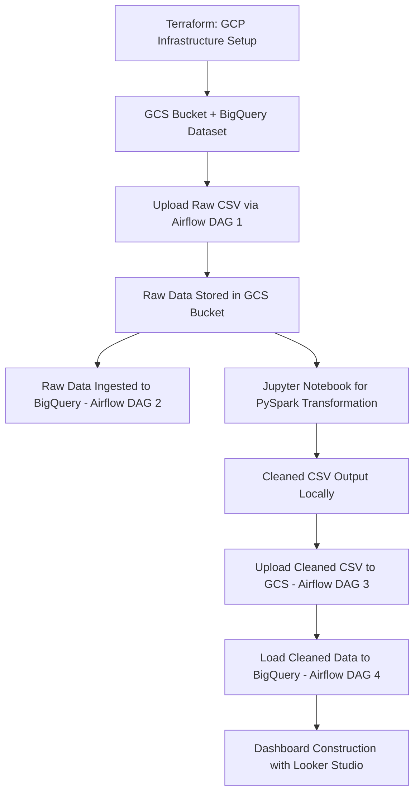

# Retail Data Pipeline Project

This repository presents a robust, enterprise-ready, cloud-native data pipeline designed for the complete processing, transformation, and visualization of retail transaction data. Built with production-level best practices in mind, the architecture not only enables full automation but also prioritizes modularity, scalability, maintainability, and secure data handling. The system leverages a suite of industry-standard technologies, including Terraform, Docker, Apache Airflow, PySpark, Google Cloud Storage (GCS), BigQuery, and Looker Studio.

The pipeline orchestrates every stage of the data lifecycle, from raw ingestion to transformation and final business insight generation. It simulates the operational role of a cloud data engineer and provides a scalable foundation for batch processing with extensibility for real-time streaming use cases. The approach adheres to infrastructure-as-code principles and incorporates best practices in workflow orchestration, distributed processing, and cloud-native analytics.

---

## Pipeline Architecture Diagram


---

## Pipeline Flow Overview (Mermaid)




---

## Project Directory Structure

```
Retail-Data-Pipeline/
├── Infrastructure/           # Terraform modules for GCP resource provisioning
├── Airflow/                  # Workflow DAGs, data, and credentials
│   ├── dags/                 # DAGs for raw and cleaned data ETL flows
│   ├── data/                 # Local staging for CSV files
│   ├── keys/                 # GCP service account credentials
├── Notebooks/                # PySpark transformation notebooks
├── Dashboard/                # Looker Studio PDF snapshot
├── Scripts/                  # Custom helper scripts (optional)
├── requirements.txt          # Python package dependencies
├── Makefile                  # Optional automation tasks
└── README.md
```

---

## Technology Stack

| Tool/Service        | Role & Purpose                                                |
| ------------------- | ------------------------------------------------------------- |
| Terraform           | Infrastructure as Code for provisioning GCP resources         |
| GCP: GCS & BigQuery | Cloud storage for raw/processed data and cloud data warehouse |
| Apache Airflow      | DAG-based orchestration and scheduling of ETL workflows       |
| PySpark             | Distributed data processing framework for transformation      |
| Jupyter Notebook    | Interactive data exploration and PySpark development          |
| Looker Studio       | Cloud-native BI platform for dashboarding and analytics       |
| Docker              | Local development and orchestration of Airflow environment    |

---

## Pipeline Phases (Detailed Execution Plan)

### Phase 1: Infrastructure Provisioning with Terraform

- Provisioned key Google Cloud resources using declarative, version-controlled Terraform scripts.
- Deployed a GCS bucket for data lake storage and a BigQuery dataset for analytical querying.
- Ensured reproducibility and modularity through isolated resource modules and parameterization.
- The foundation supports future CI/CD automation and secure secret management.

### Phase 2: Raw Data Ingestion Pipeline (Airflow)

- Built Airflow DAG 1 to upload retail CSV data into GCS.
- Implemented Airflow DAG 2 to transfer GCS data into a BigQuery staging table.
- Included retry logic, parameterization, logging, and schema enforcement.
- A modular DAG structure promotes reusability and supports multi-environment deployment.

### Phase 3: Data Transformation (PySpark via Jupyter Notebook)

- Utilized PySpark within a Jupyter notebook for high-scale local transformation.
- Applied a multi-step ETL procedure including:
  - Schema casting for numeric, categorical, and temporal fields
  - Removal of Personally Identifiable Information (PII)
  - Handling nulls via imputation and filtering
  - Normalization of categorical values
  - Business logic-based filtering (e.g., remove invalid ratings/age)
  - Column name standardization (snake\_case)
- Output saved locally as a cleaned CSV file for subsequent loading.

### Phase 4: Cleaned Data Loading

- Airflow DAG 3 re-uploaded the transformed dataset to GCS.
- Airflow DAG 4 loaded the cleaned data into a production-grade BigQuery table.
- Write operations followed `WRITE_TRUNCATE` semantics to preserve consistency and reproducibility.
- Clearly separate raw and clean pipelines for auditability and traceability.

### Phase 5: Visualization with Looker Studio

- Connected Looker Studio to the clean BigQuery dataset.
- Designed an interactive dashboard comprising:
  - Aggregated insights on regional, temporal, and demographic breakdowns
  - Transaction and revenue trends
  - Product category sales
  - Customer feedback and satisfaction metrics
- Enhanced with filtering, drill-downs, and responsive components.
- Dashboard link (public): [Retail Looker Dashboard](https://lookerstudio.google.com/reporting/32142238-71f8-4c7c-8dc2-45038440d426)

---

## Project Outcomes & Professional Relevance

This project demonstrates a production-grade implementation of cloud data engineering principles and toolsets. It showcases:

- A complete, automated ETL pipeline built on open-source and cloud-native infrastructure
- Integration of IaC, workflow orchestration, distributed data processing, and cloud BI
- Proper separation between raw and transformed data workflows for lineage and compliance
- Real-world experience in technologies used by leading tech companies
- Readiness for professional deployment and CI/CD integration

Applicable job roles: Data Engineer, Analytics Engineer, Cloud Engineer, BI Developer

---

## License

Distributed under the MIT License.

---

## Author

Developed by Sina Tavakoli

