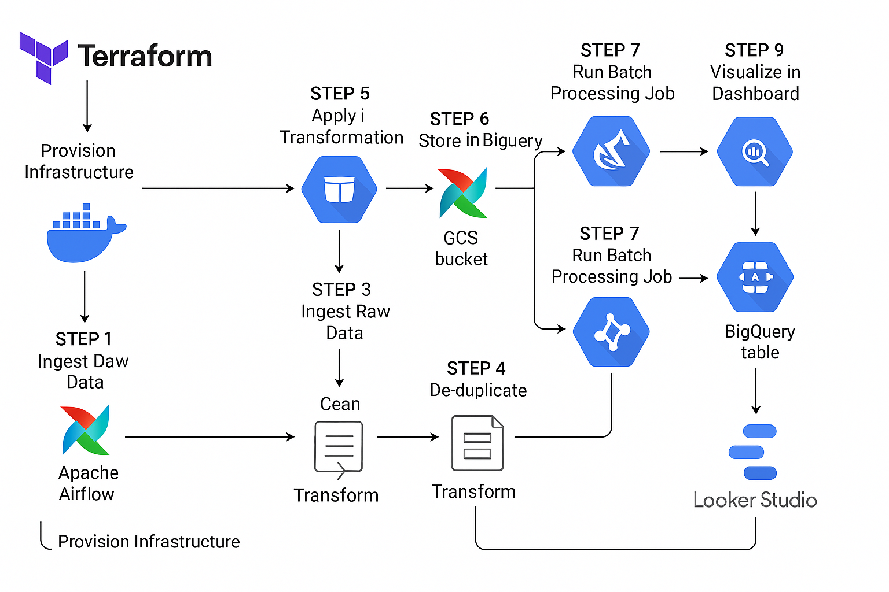

# 🛠️ Retail Data Pipeline Project

This project delivers a fully automated, end-to-end data pipeline for processing retail sales data using a modern cloud-native stack. It orchestrates the entire data lifecycle—from raw data ingestion to data transformation, cloud-based storage, and interactive dashboarding. Leveraging tools like Terraform, Docker, Apache Airflow, Google Cloud Storage (GCS), PySpark, BigQuery, and Looker Studio, the pipeline ensures scalability, maintainability, and real-time insight generation.

The pipeline starts with the upload of raw CSV retail data to GCS, triggered and scheduled through Airflow. The data is then loaded into BigQuery and transformed using PySpark in a Jupyter notebook, ensuring data cleanliness, normalization, and consistency. The cleaned data is re-uploaded to GCS and automatically loaded into a new BigQuery table. Finally, the insights are visualized via a custom dashboard built in Looker Studio, enabling stakeholders to track KPIs, customer behavior, and product trends in real time.

---

## 📸 Pipeline Architecture Diagram



## 🚀 Pipeline Overview

```mermaid
graph LR
    A[Terraform Setup] --> B(GCP Infrastructure: GCS & BigQuery)
    B --> C[Upload Raw Data via Airflow]
    C --> D[Raw Data in GCS Bucket]
    D --> E[Load Raw Data to BigQuery (Airflow)]
    D --> F[Jupyter Notebook for Transformation]
    F --> G[PySpark Data Cleaning & Preprocessing]
    G --> H[Export Cleaned CSV]
    H --> I[Upload Cleaned Data to GCS (Airflow)]
    I --> J[Load Cleaned Data to BigQuery (Airflow)]
    J --> K[Visualize with Looker Studio]

```

---

## 📂 Project Structure

```
Retail-Data-Pipeline/
├── Infrastructure/           # Terraform IaC for GCS + BigQuery
├── Airflow/                  # DAGs, configs, and logs
│   ├── dags/                 # DAGs for raw and clean data
│   ├── data/                 # Raw and clean CSVs
│   ├── keys/                 # GCP service account keys
├── Notebooks/                # Jupyter notebooks for transformation
├── Dashboard/                # Looker Studio PDF Export
├── Scripts/                  # Optional scripts
├── requirements.txt          # Python dependencies
├── Makefile                  # Automation (optional)
└── README.md
```

---

## 🧱 Technologies Used

| Tool/Service     | Role                                |
|------------------|--------------------------------------|
| Terraform        | Infrastructure provisioning          |
| Google Cloud     | Cloud provider (GCS, BigQuery)       |
| Apache Airflow   | Workflow orchestration               |
| Apache Spark     | Distributed data processing          |
| Jupyter Notebook | Local transformation in PySpark      |
| Looker Studio    | Interactive data visualization       |
| Docker           | Local development & Airflow setup    |

---

## 📌 Pipeline Phases

### 🚧 Phase 1: Infrastructure Setup (IaC with Terraform)
- Designed and provisioned core cloud resources using **Terraform** to ensure reproducibility and scalability.
- Created:
  - A **Google Cloud Storage (GCS)** bucket to store raw and transformed data.
  - A **BigQuery dataset** to store structured data for querying and analytics.
- This approach promotes infrastructure version control, modularity, and ease of deployment.

---

### 📥 Phase 2: Raw Data Ingestion (Airflow ETL Scheduling)
- Developed a **custom Airflow DAG** to automate the upload of the raw CSV retail data to GCS.
- Implemented a second DAG to load the raw data from GCS into a **BigQuery staging table** using the `GCSToBigQueryOperator`.
- Ensured schema definition and ingestion reliability with retry mechanisms and manual triggering capabilities.

---

### 🧹 Phase 3: Data Transformation (PySpark + Jupyter Notebook)
- Utilized **PySpark** inside a **Jupyter Notebook** for scalable transformation of raw data.
- Transformation tasks included:
  - Data type casting (e.g., strings → integers, dates, floats).
  - Dropping PII fields (e.g., name, email, phone) to ensure privacy.
  - Handling missing values with `dropna` and `fillna`.
  - Filtering invalid data (e.g., negative amounts, ratings outside valid range).
  - Normalizing categorical values (e.g., trimming/standardizing with lowercase).
  - Renaming columns to **snake_case** for consistency with BigQuery conventions.
- The final cleaned dataset was saved as a **CSV** file, ready for downstream processing.

---

### 📤 Phase 4: Load Transformed Data (Airflow → BigQuery)
- Another **Airflow DAG** was developed to:
  - Upload the cleaned CSV back to a new folder in the GCS bucket.
  - Load the cleaned file into a **new BigQuery table** in the previously created dataset.
- Used `WRITE_TRUNCATE` mode to ensure clean and idempotent uploads during DAG re-runs.

---

### 📊 Phase 5: Visualization & Dashboarding (Looker Studio)
- Connected the cleaned BigQuery table to **Google Looker Studio**.
- Built an **interactive dashboard** showcasing:
  - Customer segmentation by demographics.
  - Sales distribution by region and product.
  - Revenue and transaction trends.
  - Rating insights and product category breakdowns.
- Added filtering options to support stakeholder self-service exploration.
- Dashboard Link: 👉 [Retail Looker Dashboard](https://lookerstudio.google.com/reporting/32142238-71f8-4c7c-8dc2-45038440d426)


---

## 📄 License

This project is licensed under the MIT License.

---

## ✨ Credits

Created with ❤️ by Sina Tavakoli

