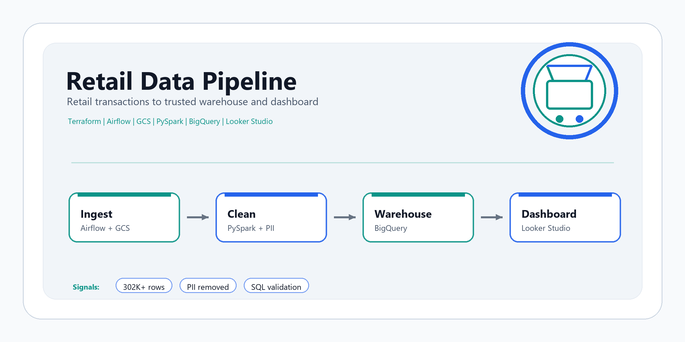
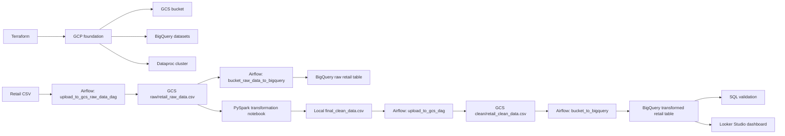

# Retail Data Pipeline

**End-to-end cloud data engineering pipeline for retail transaction analytics using Terraform, Docker, Apache Airflow, Google Cloud Storage, Dataproc/PySpark, BigQuery, SQL validation, and Looker Studio.**

[GitHub profile](https://github.com/sntk-76) | [Looker Studio dashboard](https://lookerstudio.google.com/reporting/32142238-71f8-4c7c-8dc2-45038440d426) | [Dashboard PDF](Dashboard/report/Retail_data_pipeline.pdf)

## Overview

Retail Data Pipeline is a cloud-native batch data engineering project that moves retail transaction data from local CSV ingestion into Google Cloud Storage, BigQuery warehouse tables, PySpark transformation logic, validation queries, and a business-facing Looker Studio dashboard.

The project is designed to demonstrate the full lifecycle of a modern analytics platform: infrastructure provisioning, raw data ingestion, warehouse loading, data cleaning, privacy-aware transformation, schema-controlled BigQuery delivery, SQL-based validation, and BI reporting.

## Why This Project Matters

Retail analytics is a practical data engineering use case because transaction datasets combine customer attributes, product metadata, payment behavior, geography, time dimensions, and revenue measures. A useful pipeline must preserve raw traceability while also producing clean analytical tables that business users can trust.

This repository shows the kind of cross-layer work expected from a data engineer: cloud infrastructure, orchestration, distributed transformation, warehouse schemas, data quality checks, and dashboard enablement.

## Core Capabilities

| Capability | Implementation |
| --- | --- |
| Infrastructure as code | Terraform provisions a GCS bucket, raw and transformed BigQuery datasets, and a Dataproc cluster foundation. |
| Local orchestration | Docker Compose provides the local Airflow runtime. |
| Raw ingestion | Airflow uploads `retail_new_data.csv` to GCS under `raw/retail_raw_data.csv`. |
| Raw warehouse load | Airflow loads the raw CSV from GCS into BigQuery with an explicit schema. |
| Distributed transformation | PySpark casts types, removes duplicates, handles nulls, filters invalid values, normalizes categories, and removes sensitive fields. |
| Clean data delivery | Airflow uploads `final_clean_data.csv` to GCS and loads it into a transformed BigQuery dataset. |
| Quality validation | SQL checks validate nulls, duplicate transactions, date anomalies, negative purchases, and payment-method categories. |
| BI reporting | Looker Studio presents the cleaned retail data as an analytics dashboard. |

## Architecture


```mermaid
flowchart LR
    A[Terraform] --> B[GCP foundation]
    B --> C[GCS bucket]
    B --> D[BigQuery datasets]
    B --> E[Dataproc cluster]

    F[Retail CSV] --> G[Airflow: upload_to_gcs_raw_data_dag]
    G --> H[GCS raw/retail_raw_data.csv]
    H --> I[Airflow: bucket_raw_data_to_bigquery]
    I --> J[BigQuery raw retail table]

    H --> K[PySpark transformation notebook]
    K --> L[Local final_clean_data.csv]
    L --> M[Airflow: upload_to_gcs_dag]
    M --> N[GCS clean/retail_clean_data.csv]
    N --> O[Airflow: bucket_to_bigquery]
    O --> P[BigQuery transformed retail table]

    P --> Q[SQL validation]
    P --> R[Looker Studio dashboard]
```

## Technical Stack

| Layer | Tools |
| --- | --- |
| Infrastructure | Terraform, Google Cloud Platform |
| Storage | Google Cloud Storage |
| Processing foundation | Google Dataproc, PySpark |
| Orchestration | Apache Airflow, Docker Compose |
| Warehouse | BigQuery |
| Data quality | BigQuery SQL validation queries |
| BI | Looker Studio |
| Development | Jupyter notebooks, Python |

## Repository Structure

```text
Retail-Data-Pipeline/
|-- Airflow/
|   |-- dags/                         # DAGs for raw and clean data movement
|   `-- docker-compose.yaml            # Local Airflow runtime
|-- Dashboard/
|   `-- report/
|       `-- Retail_data_pipeline.pdf   # Exported Looker Studio report
|-- Data/                              # Local data staging placeholder
|-- Infrastructure/                    # Terraform GCP configuration
|-- Notebooks/
|   |-- transformation.ipynb           # PySpark transformation workflow
|   `-- convert_to _int.ipynb          # Type-conversion exploration
|-- Scripts/                           # Helper script placeholder
|-- assets/
|   `-- retail-data-pipeline-cover.png
|-- Query.txt                          # BigQuery validation queries
|-- pipeline_diagram.png               # Legacy architecture diagram
|-- requirements.txt
|-- LICENSE
`-- README.md
```

## Pipeline Workflow

1. Provision the GCP foundation with Terraform.
2. Run Airflow locally with Docker Compose.
3. Upload the raw retail CSV into Google Cloud Storage.
4. Load the raw GCS object into BigQuery using a controlled schema.
5. Transform the dataset with PySpark in Jupyter.
6. Remove personally identifiable fields from the clean analytical output.
7. Filter invalid business values such as negative amounts, invalid ages, and ratings outside the expected range.
8. Normalize categorical fields and create a clean schema.
9. Upload the cleaned CSV to GCS.
10. Load the cleaned data into the transformed BigQuery dataset.
11. Run SQL validation checks against warehouse data.
12. Build a Looker Studio dashboard for business analysis.

## Airflow DAGs

| DAG | File | Purpose |
| --- | --- | --- |
| `upload_to_gcs_raw_data_dag` | `Airflow/dags/upload_to_GCS_raw_data.py` | Uploads local raw retail data into the GCS raw zone. |
| `bucket_raw_data_to_bigquery` | `Airflow/dags/GCS_to_bigquery_raw_data.py` | Loads raw GCS data into the BigQuery raw table. |
| `upload_to_gcs_dag` | `Airflow/dags/upload_to_GCS_clean_data.py` | Uploads the transformed clean CSV into the GCS clean zone. |
| `bucket_to_bigquery` | `Airflow/dags/GCS_to_bigquery_clean_data.py` | Loads clean GCS data into the transformed BigQuery table. |

## Terraform Infrastructure

The Terraform layer provisions:

- A Google Cloud Storage bucket for raw and clean data assets.
- A BigQuery dataset for raw retail data.
- A BigQuery dataset for transformed retail data.
- A Dataproc cluster foundation for Spark processing.

```bash
cd Infrastructure
terraform init
terraform plan
terraform apply
```

## Transformation Logic

The PySpark transformation notebook prepares raw retail records for analytics by applying practical data engineering rules:

- Casts transaction, customer, purchase, amount, date, and rating fields to analytical types.
- Removes duplicate records.
- Drops records missing critical measures such as transaction ID, customer ID, amount, and total amount.
- Fills selected missing categorical and demographic fields with controlled defaults.
- Removes personally identifiable columns including name, email, phone, and address.
- Filters invalid values for amount, total amount, age, and rating.
- Standardizes categorical fields with lowercasing and trimming.
- Produces a snake_case clean output for downstream loading.

## Data Validation

`Query.txt` contains BigQuery checks for warehouse validation, including:

- Row-count verification.
- Null checks for key business fields.
- Earliest and latest transaction dates.
- Future-date detection.
- Duplicate transaction detection.
- Negative purchase checks.
- Payment-method category inspection.

## Dashboard Layer

The Looker Studio dashboard turns the transformed BigQuery data into a business-facing report for retail analysis. It is designed to support exploration of transaction patterns, customer segments, revenue behavior, product categories, payment behavior, and geographic trends.

- Public dashboard: [Retail Looker Dashboard](https://lookerstudio.google.com/reporting/32142238-71f8-4c7c-8dc2-45038440d426)
- PDF export: [Dashboard/report/Retail_data_pipeline.pdf](Dashboard/report/Retail_data_pipeline.pdf)

## Running Locally

```bash
git clone https://github.com/sntk-76/Retail-Data-Pipeline.git
cd Retail-Data-Pipeline
```

Provision infrastructure:

```bash
cd Infrastructure
terraform init
terraform plan
terraform apply
```

Start Airflow:

```bash
cd ../Airflow
docker-compose up
```

Then open the Airflow UI at `http://localhost:8080` and trigger the DAGs in pipeline order.

## Project Highlights

- Demonstrates the complete journey from raw retail CSV to cloud warehouse and BI reporting.
- Separates raw and transformed warehouse layers for traceability.
- Uses explicit BigQuery schemas instead of relying on uncontrolled inference.
- Applies privacy-aware data transformation by removing direct customer identifiers from the clean dataset.
- Combines infrastructure, orchestration, distributed processing, SQL validation, and dashboard delivery in one portfolio project.

## Future Improvements

- Convert the notebook transformation into a reusable PySpark job.
- Connect Airflow directly to the Dataproc transformation step.
- Add automated dependencies between DAGs for a single end-to-end run.
- Add CI checks for DAG imports and Terraform formatting.
- Add Great Expectations or dbt tests for structured data quality enforcement.

## License

This project is licensed under the [MIT License](LICENSE).
